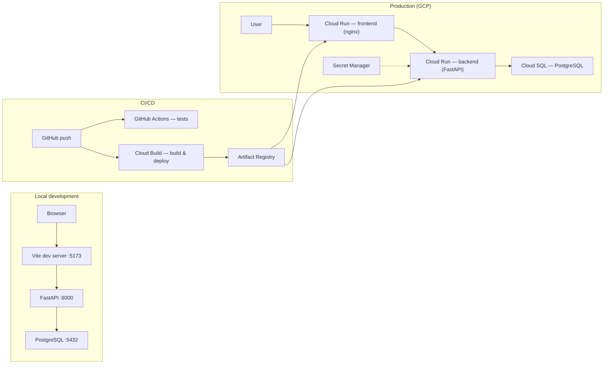

# LearnSphere

A Student Management System for colleges and training institutes. LearnSphere replaces spreadsheet-based workflows with a secure web platform for managing students, courses, enrollments, attendance, and timetables.

## Live demo (GCP)

| Service | URL |
|---------|-----|
| Web app | https://learnsphere-frontend-lupqesfcia-uc.a.run.app |
| API | https://learnsphere-backend-lupqesfcia-uc.a.run.app |
| Health check | https://learnsphere-backend-lupqesfcia-uc.a.run.app/health |
| Swagger docs | https://learnsphere-backend-lupqesfcia-uc.a.run.app/docs |

Use the [demo credentials](#demo-credentials) below. The demo runs on Google Cloud Run with Cloud SQL (PostgreSQL). If the database instance is stopped to save cost, the app will be unavailable until it is started again.

## Features

- **JWT authentication** with role-based access (Admin, Student)
- **Student management** — CRUD, filtering, and department/semester tracking
- **Course management** — core and elective courses with instructor metadata
- **Enrollment management** — assign students to courses
- **Attendance tracking** — daily records with status validation and reporting
- **Smart timetable scheduling** — weekly grids, conflict detection, and auto-generation
- **Dashboards** — admin analytics and student self-service views
- **API documentation** — interactive Swagger UI at `/docs`

## Tech stack

| Layer | Technologies |
|-------|--------------|
| Backend | FastAPI, SQLAlchemy, Alembic, Pydantic, JWT (python-jose) |
| Frontend | React 19, Vite, Tailwind CSS, React Router, Axios |
| Database | PostgreSQL 16 |
| Local runtime | Podman/Docker Compose (Postgres only) |
| Containers | Podman/Docker (`backend/Containerfile`, `frontend/Containerfile`) |
| CI | GitHub Actions — pytest + Jest on push/PR to `main` and `develop` |
| CD | Google Cloud Build — deploy to Cloud Run on push to `main` |
| Cloud (GCP) | Cloud Run, Cloud SQL, Artifact Registry, Secret Manager |

## Architecture



**Hybrid pipeline:** GitHub Actions runs tests on every push and pull request. Cloud Build (`cloudbuild.yaml`) builds container images, pushes them to Artifact Registry, deploys backend and frontend to Cloud Run, and updates backend CORS to match the live frontend URL.

## Project structure

```
learnsphere/
├── backend/           # FastAPI app, Alembic migrations, seed script
├── frontend/          # React + Vite SPA
├── docs/              # ERD, timetable automation notes
├── cloudbuild.yaml    # GCP CD pipeline (main branch)
├── docker-compose.yml # Local PostgreSQL only
└── .github/workflows/ # CI workflow
```

## Prerequisites

- Python 3.11+
- Node.js 20+
- Podman or Docker (PostgreSQL locally; optional for container builds)

## Run the app locally

Use **3 terminals**. After the first-time setup below, you only need the commands in **Every day**.

### First-time setup (once)

**Terminal 1 — database**

```bash
podman machine start          # Mac only, skip if already running
podman compose up -d
```

**Terminal 2 — backend**

```bash
cd backend
python -m venv .venv
source .venv/bin/activate
pip install -r requirements-dev.txt
cp .env.example .env
alembic upgrade head
python scripts/seed_data.py
```

**Terminal 3 — frontend**

```bash
cd frontend
npm install
cp .env.example .env
```

### Every day (see your code changes)

**Terminal 1 — database** (skip if already running)

```bash
podman compose up -d
```

**Terminal 2 — backend** (hot reload — restarts when you save Python files)

```bash
cd backend
source .venv/bin/activate
uvicorn app.main:app --reload --port 8000
```

**Terminal 3 — frontend** (hot reload — updates the browser when you save React files)

```bash
cd frontend
npm run dev
```

| What | URL |
|------|-----|
| Web app | http://localhost:5173 |
| API | http://localhost:8000 |
| Swagger docs | http://localhost:8000/docs |

### Demo credentials

After running the seed script:

| Role | Email | Password |
|------|-------|----------|
| Admin | `admin@learnsphere.com` | `Admin123` |
| Student | `{dept}.sem{N}@learnsphere.com` (e.g. `CSE.sem1@learnsphere.com`) | `student123` |

## Testing

```bash
# Backend (from backend/)
pytest

# Frontend (from frontend/)
npm test
npm run test:coverage
```

CI runs the same tests on pushes and PRs to `main` and `develop`.

## Environment variables

### Backend (`backend/.env`)

Copy from `backend/.env.example`. Defaults work for local development.

| Variable | Purpose |
|----------|---------|
| `SECRET_KEY` | JWT signing key (required in production) |
| `POSTGRES_*` | Database connection (local / Docker) |
| `DATABASE_URL` | Full connection string (overrides `POSTGRES_*`; used on Cloud Run) |
| `CORS_ORIGINS` | Comma-separated frontend URLs |
| `APP_ENV` | `development` or `production` |

### Frontend (`frontend/.env`)

Copy from `frontend/.env.example`:

```
VITE_API_BASE_URL=http://localhost:8000
```

In production, this is baked into the frontend image at build time via the `VITE_API_BASE_URL` build arg in `frontend/Containerfile`.

## Deployment (GCP)

Deployment is automated by Cloud Build when changes are pushed to `main`. The pipeline:

1. Builds and pushes backend and frontend images to Artifact Registry
2. Deploys backend to Cloud Run with Cloud SQL connector and Secret Manager secrets
3. Builds frontend with the live backend URL as `VITE_API_BASE_URL`
4. Deploys frontend to Cloud Run
5. Updates backend `CORS_ORIGINS` to the live frontend URL

**Secrets (Secret Manager):** `learnsphere-secret-key`, `learnsphere-database-url`

**Manual deploy** (from repo root, with `gcloud` configured):

```bash
gcloud builds submit --config=cloudbuild.yaml
```

**Pause Cloud SQL overnight** (reduces billing; app unavailable while stopped):

```bash
gcloud sql instances patch learnsphere-db --activation-policy=NEVER
```

**Start again:**

```bash
gcloud sql instances patch learnsphere-db --activation-policy=ALWAYS
```


## Project status

**MVP complete** — auth, students, courses, enrollments, attendance, timetables, and dashboards are implemented with backend API tests, frontend component tests, and CI quality gates.

**GCP deployment complete** — containerized backend and frontend run on Cloud Run with Cloud SQL PostgreSQL, hybrid CI/CD (GitHub Actions + Cloud Build), and production secrets via Secret Manager.
